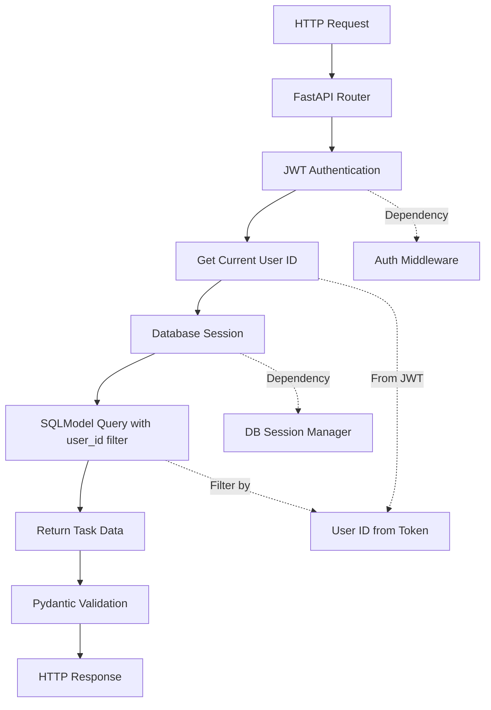

# Implementation Plan: RESTful API Development (CRUD Logic)

**Branch**: `4-rest-api` | **Date**: 2026-01-14 | **Spec**: [specs/4-rest-api/spec.md](specs/4-rest-api/spec.md)
**Input**: Feature specification from `/specs/4-rest-api/spec.md`

**Note**: This template is filled in by the `/sp.plan` command. See `.specify/templates/commands/plan.md` for the execution workflow.

## Summary

Implementation of a secure, authenticated RESTful API for task management with full CRUD operations (Create, Read, Update, Delete) plus completion toggling. The API will ensure complete data isolation between users by filtering all database queries by the authenticated user ID extracted from JWT tokens. Built with FastAPI, SQLModel, and Neon Serverless PostgreSQL.

## Technical Context

**Language/Version**: Python 3.13+, TypeScript
**Primary Dependencies**: FastAPI for web framework, SQLModel for ORM, Pydantic for validation, Neon Serverless PostgreSQL for database
**Storage**: Neon Serverless PostgreSQL (existing User and Task tables from Spec 1 & 2)
**Testing**: pytest for backend, httpx for API testing
**Target Platform**: REST API for task management
**Project Type**: Backend API service
**Performance Goals**: <500ms response time for 95% of requests, support 100+ concurrent authenticated users
**Constraints**: <500ms p95 for API endpoints, secure handling of JWT tokens, proper data isolation between users
**Scale/Scope**: Support for 1000+ concurrent authenticated users with proper session management and data isolation

## Constitution Check

*GATE: Must pass before Phase 0 research. Re-check after Phase 1 design.*

- **Test-First Development**: Implementation will follow TDD practices with comprehensive coverage for API endpoints and data isolation
- **Scalability-Driven Architecture**: JWT-based stateless authentication enables horizontal scaling of backend services
- **AI-First Design Philosophy**: API will be designed to support future AI integration in subsequent phases
- **DevOps Integration**: Environment variables for secrets will support both local and cloud deployments
- **Platform-Agnostic Implementation**: Solution will work across local development and cloud environments
- **RESTful Standards Compliance**: API will follow REST conventions and proper HTTP status codes

## Project Structure

### Documentation (this feature)

```text
specs/4-rest-api/
├── plan.md              # This file (/sp.plan command output)
├── research.md          # Phase 0 output (/sp.plan command)
├── data-model.md        # Phase 1 output (/sp.plan command)
├── quickstart.md        # Phase 1 output (/sp.plan command)
├── contracts/           # Phase 1 output (/sp.plan command)
└── tasks.md             # Phase 2 output (/sp.tasks command - NOT created by /sp.plan)
```

### Source Code (repository root)

```text
backend/
├── src/
│   ├── config/
│   │   └── settings.py          # Environment variables including BETTER_AUTH_SECRET
│   ├── auth/
│   │   ├── middleware.py        # JWT verification middleware/dependency
│   │   ├── utils.py             # JWT encoding/decoding utilities
│   │   └── schemas.py           # Authentication-related schemas
│   ├── database/
│   │   ├── models/
│   │   │   ├── user.py          # User model from Spec 1
│   │   │   └── task.py          # Task model from Spec 1
│   │   ├── engine.py
│   │   ├── session.py
│   │   └── init_db.py
│   └── api/
│       ├── v1/
│       │   └── endpoints/
│       │       ├── users.py     # User endpoints from Spec 2
│       │       ├── auth.py      # Authentication endpoints from Spec 2
│       │       └── tasks.py     # NEW: Task CRUD endpoints for this spec
│       └── deps.py              # Dependency injection for authenticated users
├── tests/
│   ├── unit/
│   ├── integration/
│   │   └── test_api_tasks.py    # API tests for task endpoints
│   └── conftest.py
└── requirements.txt
```

**Structure Decision**: Selected backend API structure with versioned endpoints in separate modules to maintain clear separation of concerns between authentication and task management.

## Complexity Tracking

> **Fill ONLY if Constitution Check has violations that must be justified**

| Violation | Why Needed | Simpler Alternative Rejected Because |
|-----------|------------|-------------------------------------|
| Cross-service authentication | Secure communication between frontend and backend services | Direct database access would bypass authentication and violate data isolation |
| JWT stateless architecture | Horizontal scalability requirements | Session-based authentication would require shared session storage across services |

## Phase 0: Research & Discovery

**Goal**: Investigate FastAPI best practices, SQLModel patterns, and data isolation techniques

### Research Tasks

#### R001: FastAPI Response Model Optimization
- **Investigation**: Best practices for FastAPI's response_model parameter and Pydantic schema validation
- **Expected Outcome**: Understanding of optimal response model patterns for CRUD operations
- **Timeline**: 1 day

#### R002: SQLModel Filtering Patterns
- **Investigation**: Efficient filtering patterns for user-based data isolation in SQLModel
- **Expected Outcome**: Optimal approach for filtering by user_id in all database queries
- **Timeline**: 1 day

#### R003: API Error Handling Strategy
- **Investigation**: Best practices for returning 404 vs 403 for unauthorized resource access
- **Expected Outcome**: Consistent error handling approach that prevents data enumeration
- **Timeline**: 1 day

#### R004: Task Completion Toggle Design
- **Investigation**: Best practices for implementing completion status toggle (PUT vs PATCH)
- **Expected Outcome**: Decision on optimal HTTP method for toggling task completion
- **Timeline**: 1 day

## Phase 1: Foundation & Design

**Goal**: Establish core architecture, define data models, and create API contracts

### Foundation Tasks

#### F001: Task Endpoint Router Setup
- **Action**: Create task endpoint router in `backend/src/api/v1/endpoints/tasks.py`
- **Deliverables**: Basic FastAPI router with dependency injection setup
- **Dependencies**: Auth middleware from Spec 2, database session from Spec 1
- **Timeline**: 1 day

#### F002: Pydantic Schema Definition
- **Action**: Define request/response schemas for task operations
- **Deliverables**: TaskCreate, TaskUpdate, TaskResponse Pydantic models
- **Dependencies**: Task model from Spec 1
- **Timeline**: 1 day

#### F003: Database CRUD Operations
- **Action**: Implement SQLModel-based CRUD operations with user filtering
- **Deliverables**: Functions for create_task_for_user, get_tasks_for_user, etc.
- **Dependencies**: Task model from Spec 1
- **Timeline**: 2 days

## Phase 2: Analysis & Integration

**Goal**: Design detailed logic for each endpoint with proper authentication and authorization

### Analysis Tasks

#### A001: GET /api/tasks Endpoint Design
- **Action**: Design endpoint to list all tasks for authenticated user
- **Logic**: Filter by user_id from JWT token, return paginated results
- **Security**: Ensure user can only see their own tasks
- **Timeline**: 1 day

#### A002: POST /api/tasks Endpoint Design
- **Action**: Design endpoint to create new task for authenticated user
- **Logic**: Assign task to user_id from JWT token, validate input
- **Security**: Ensure task is created for authenticated user only
- **Timeline**: 1 day

#### A003: GET /api/tasks/{id} Endpoint Design
- **Action**: Design endpoint to get specific task details
- **Logic**: Filter by user_id and task_id, return 404 if not found
- **Security**: Prevent access to other users' tasks
- **Timeline**: 1 day

#### A004: PUT /api/tasks/{id} Endpoint Design
- **Action**: Design endpoint to update task details
- **Logic**: Validate ownership by user_id, update task fields
- **Security**: Prevent modification of other users' tasks
- **Timeline**: 1 day

#### A005: DELETE /api/tasks/{id} Endpoint Design
- **Action**: Design endpoint to delete a task
- **Logic**: Validate ownership by user_id, delete if authorized
- **Security**: Prevent deletion of other users' tasks
- **Timeline**: 1 day

#### A006: PATCH /api/tasks/{id}/complete Endpoint Design
- **Action**: Design endpoint to toggle task completion status
- **Logic**: Validate ownership by user_id, toggle completion status
- **Security**: Prevent modification of other users' tasks
- **Timeline**: 1 day

## Phase 3: Synthesis & Validation

**Goal**: Finalize implementation approach and prepare for development

### Synthesis Tasks

#### S001: Error Handling Strategy Finalization
- **Action**: Finalize consistent error handling across all endpoints
- **Decision**: Return 404 for unauthorized access to prevent data enumeration
- **Documentation**: Clear error response format specification
- **Timeline**: 1 day

#### S002: Testing Strategy Preparation
- **Action**: Prepare comprehensive test strategy for all endpoints
- **Focus**: Data isolation validation, authentication verification
- **Tools**: pytest with httpx for API testing
- **Timeline**: 1 day

#### S003: Performance Optimization Plan
- **Action**: Identify potential performance bottlenecks and optimization strategies
- **Focus**: Database query optimization, connection pooling
- **Metrics**: Target <500ms response times
- **Timeline**: 1 day

## Technical Decisions & Tradeoffs

### TD-001: HTTP Method for Completion Toggle
- **Decision**: Use PATCH method for toggling task completion status
- **Rationale**: PATCH is semantically appropriate for partial updates like toggling a boolean field
- **Alternative Considered**: PUT could work but implies full resource replacement
- **Impact**: More RESTful API design that follows HTTP standards

### TD-002: API Response Structure
- **Decision**: Use direct data representation (not wrapped in 'data' key)
- **Rationale**: Simpler client consumption, follows FastAPI/Pydantic conventions
- **Alternative Considered**: Wrapped responses with metadata (e.g., pagination)
- **Impact**: Cleaner, more straightforward API responses for this MVP

### TD-003: Error Response Strategy
- **Decision**: Return 404 Not Found for unauthorized access to prevent data enumeration
- **Rationale**: Security best practice to avoid revealing whether resources exist
- **Alternative Considered**: Return 403 Forbidden for unauthorized access
- **Impact**: Enhanced security by not leaking information about resource existence

### TD-004: Data Filtering Approach
- **Decision**: Filter all database queries by user_id at the application layer
- **Rationale**: Ensures data isolation even if database permissions are misconfigured
- **Alternative Considered**: Database-level row-level security
- **Impact**: Defense-in-depth security approach

## Implementation Architecture

### Component Interactions



### Security Architecture

- **Authentication Layer**: JWT token validation using middleware from Spec 2
- **Authorization Layer**: User ID extraction and validation against resource ownership
- **Data Layer**: SQLModel queries with user_id filters applied to every operation
- **Transport Layer**: HTTPS enforcement via security headers

## Testing Strategy

### Unit Tests
- Individual function testing for CRUD operations
- Validation of user_id filtering logic
- Error handling verification

### Integration Tests
- End-to-end API testing with authenticated requests
- Data isolation validation (user A cannot access user B's data)
- JWT token validation and expiration handling

### Critical Security Test
- **Test Case**: Verify that an authenticated user cannot delete or update a task belonging to a different user ID
- **Method**: Create tasks for multiple users, attempt cross-user operations
- **Expected Result**: All cross-user operations return 404 Not Found

## Quality Validation Checklist

- [ ] All endpoints require JWT authentication
- [ ] Every database query filters by user_id
- [ ] Error responses follow consistent format
- [ ] HTTP status codes match REST conventions
- [ ] Pydantic validation is applied to all request bodies
- [ ] Response models are properly defined and used
- [ ] Data isolation is validated in tests
- [ ] Performance targets are achievable
- [ ] API follows RESTful conventions
- [ ] Security best practices are implemented